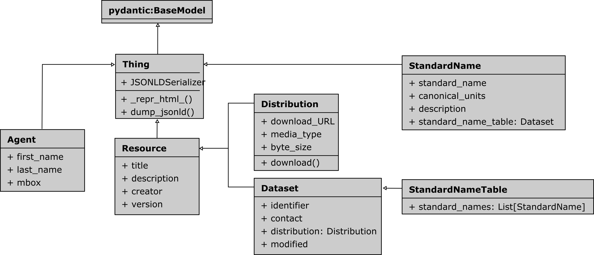

# sSNOlib


A Python library to work with the [sSNO ontology](https://matthiasprobst.github.io/ssno/). It provides Python classes
for the ontology classes and facilitates the creation of JSON-LD files. JSON-LD files are both human- and machine
readable and most importantly machine-actionable. The library can be integrated in you data (conversion) pipelines.

## Quickstart

With `ssnolib` you can create Standard Names and their tables quickly and easily. You can find Jupyter Lab Notebooks
explaining working with [Standard names here](docs/Standard%20Name.ipynb)
or [Standard Name Tables here](docs/StandardNameTable.ipynb).

The code below gives a quick insight using the *sSNOlib* classes:

```python
import ssnolib

distribution = ssnolib.Distribution(
    title='XML Table',
    download_URL='http://cfconventions.org/Data/cf-standard-names/current/src/cf-standard-name-table.xml',
    media_type='application/xml'
)
snt = ssnolib.StandardNameTable(title='CF Standard Name Table (latest version)',
                                distribution=distribution)
```

```json
{
  "@context": {
    "@import": "https://raw.githubusercontent.com/matthiasprobst/ssno/main/ssno_context.jsonld"
  },
  "@graph": [
    {
      "@id": "_:",
      "@type": "StandardNameTable",
      "distribution": {
        "@id": "_:Nf41843a8531647a19824d884268e8c59"
      },
      "title": "CF Standard Name Table (latest version)"
    },
    {
      "@id": "_:Nf41843a8531647a19824d884268e8c59",
      "@type": "Distribution",
      "download URL": "http://cfconventions.org/Data/cf-standard-names/current/src/cf-standard-name-table.xml",
      "media type": "https://www.iana.org/assignments/media-types/application/xml",
      "title": "XML Table"
    }
  ]
}
```

## Installation

```bash
pip install git+https://github.com/matthiasprobst/SSNOlib.git
```

To be able to read standard name tables in XML format (e.g. the cfconvetions.org standard name table), you need to add
the `xml` extra:

```bash
pip install git+https://github.com/matthiasprobst/SSNOlib.git[xml]
``` 

To be able to read standard name table from YAML files, you need to add the `yaml` extra:

```bash
pip install git+https://github.com/matthiasprobst/SSNOlib.git[yaml]
``` 

## Documentation

A complete documentation is still under development. However, the docstrings of the classes and methods should be
sufficient to get started. Also have a look at the [Tutorial Notebook](docs/Tutorial.ipynb) or following class diagram
and the [usage](#usage) examples below.



## Usage

Describe a Standard Name Table ith *sSNO*. Let's take the one from cfconventions.org as an example:

```python
import ssnolib

# Create a distribution object (downloadable XML file containing the standard name table)
distribution = ssnolib.Distribution(title='XML Table',
                                    download_URL='http://cfconventions.org/Data/cf-standard-names/current/src/cf-standard-name-table.xml',
                                    media_type='application/xml')

# Create a standard name table object
snt = ssnolib.StandardNameTable(title='CF Standard Name Table v79',
                                distribution=[distribution, ])

# To describe this standard name table, we can export the JSON-LD file:
with open('cf79.jsonld', 'w', encoding='utf-8') as f:
    f.write(snt.dump_jsonld())
```

The corresponding JSON-LD file looks like this (showing only 2 standard names for shortness):

```json
{
  "@context": {
    "@import": "https://raw.githubusercontent.com/matthiasprobst/ssno/main/ssno_context.jsonld"
  },
  "@graph": [
    {
      "@id": "_:",
      "@type": "StandardNameTable",
      "title": "CF Standard Name Table 83",
      "version": "83",
      "has_standard_names": [
        {
          "@id": "_:acoustic_area_backscattering_strength_in_sea_water"
        },
        {
          "@id": "_:acoustic_signal_roundtrip_travel_time_in_sea_water"
        }
      ],
      "https://matthiasprobst.github.io/ssno#contact": {
        "@id": "_:contact"
      }
    },
    {
      "@id": "_:contact",
      "@type": "Person",
      "mbox": "support@ceda.ac.uk"
    },
    {
      "@id": "_:acoustic_area_backscattering_strength_in_sea_water",
      "@type": "StandardName",
      "canonical_units": "",
      "description": "Acoustic area backscattering strength is 10 times the log10 of the ratio of the area backscattering coefficient to the reference value, 1 (m2 m-2). Area backscattering coefficient is the integral of the volume backscattering coefficient over a defined distance. Volume backscattering coefficient is the linear form of acoustic_volume_backscattering_strength_in_sea_water. For further details see MacLennan et. al (2002) doi:10.1006/jmsc.2001.1158.",
      "standard_name": "acoustic_area_backscattering_strength_in_sea_water"
    },
    {
      "@id": "_:acoustic_signal_roundtrip_travel_time_in_sea_water",
      "@type": "StandardName",
      "canonical_units": "",
      "description": "The quantity with standard name acoustic_signal_roundtrip_travel_time_in_sea_water is the time taken for an acoustic signal to propagate from the emitting instrument to a reflecting surface and back again to the instrument. In the case of an instrument based on the sea floor and measuring the roundtrip time to the sea surface, the data are commonly used as a measure of ocean heat content.",
      "standard_name": "acoustic_signal_roundtrip_travel_time_in_sea_water"
    }
  ]
}
```

### Standard name to JSON-LD

```python
import ssnolib

air_temp = ssnolib.StandardName(standard_name='air_temperature',
                                canonical_units='K',
                                description='Air temperature is the bulk temperature of the air, not the surface (skin) temperature.')

# write to JSON-LD
with open('air_temperature.json', 'w') as f:
    f.write(air_temp)
```

The corresponding JSON-LD file looks like this:

```json
{
  "@context": {
    "@import": "https://raw.githubusercontent.com/matthiasprobst/ssno/main/ssno_context.jsonld"
  },
  "@id": "_:",
  "@type": "StandardName",
  "canonical units": "https://qudt.org/vocab/unit/K",
  "description": "Air temperature is the bulk temperature of the air, not the surface (skin) temperature.",
  "standard name": "air_temperature"
}
```

You can now take the JSON-LD file and use it with your data (place it next to it, upload it to a server, etc.).

## Contribution

Contributions are welcome. Please open an issue or a pull request.

### Design of model classes

Attributes of the model classes should be the pref label as defined in the ontology. Underscores will be replaced with
spaces when dumping to JSON-LD files. E.g. `canonical_units` will be `canonical units`  or
`downloadURL` will be `download URL`  in the JSON-LD file.